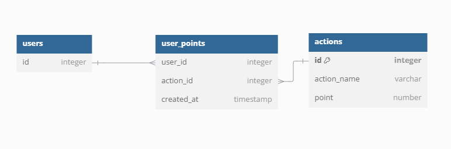
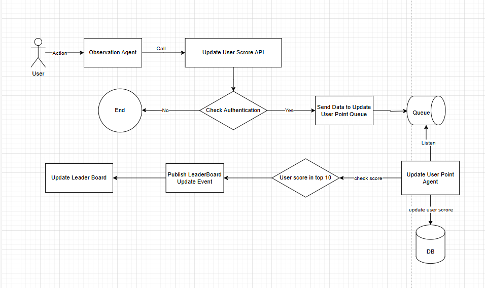

# Software Module Specification

## 1. Module Name: Live Scoreboard
## 2. Description
This module responsible for updating the score board based on the user action and result back the top 10 user with the hightest scores. 
This module track the user action in real time and update the scroreboard ranking. 
This module use authorization check to prevent malicious user action to affect the scoreboard. 
## 3. Functionality
#### Update User Score API:
Receives an API request contain data of the user action.
Authorizes the request using JWT.
Send data to Update User Score QUEUE
Returns a success or failure response.

#### Update User Score Queue Consumer:
Recieve data.
Store data to DB.
Check leaderboard.
Boardcast LeaderBoard Update Event. 

#### Get Leaderboard API:
Connect to the database.
Retrieve the top 10 user with the highest score.
Return data in json format.

## 4. Data Model:

## 5. Diagram:

## 7. Improvement:
####  Rate Limiting:
Implement rate limiting to prevent malicious users or bots from perform action.
Method: Using time rate to prevent user from perform same action in short period of time.

####  Caching:
Cache leaderboard to reduce API call frequently. (Redis)
####  Apply retry to queue consumer to retry the failed record:
Using retry method to re-execute the fail data if any.
Using deadletter queue to store the data that fail exceed the retry threadhold.

### Using Load Balancer to scale the API Agent.
Config Load Balancer to scale the API instance. Scale up when recieve more API call, down when recieve less API call.

